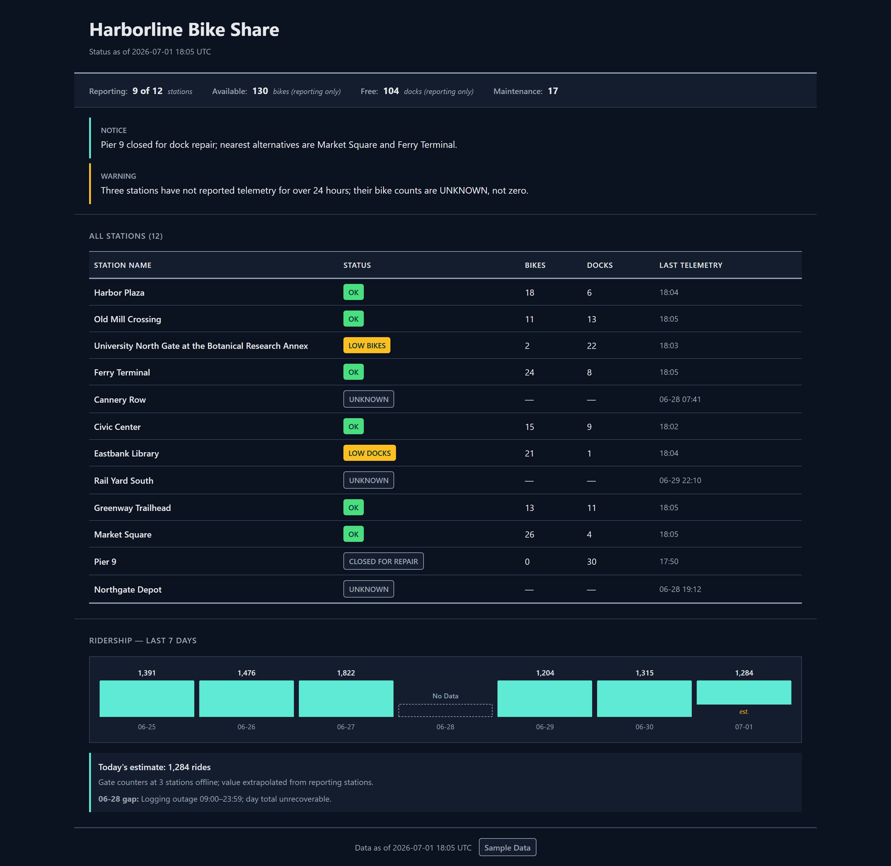

<p align="center">
  
</p>

# PixelHelm

[](https://gitlab.com/krahul02004/PixelHelm/-/commits/main)
[](https://pypi.org/project/pixelhelm/)
[](LICENSE)

PixelHelm makes an AI agent design UI the way a team does: ground the brief in the
project's real data, generate competing candidates, render them in a real browser,
judge the renders against accessibility and honesty floors, repair, repeat. It ships
as two Claude Code plugin editions plus a small Python package (`pixelhelm` on PyPI)
that runs the evidence side of that loop on its own. The page below was designed by
this loop from checked-in sample data — it is the repository's own output, not a
mockup.



**The honesty floor.** Most design tooling stops at "does it look good". PixelHelm
also enforces that a page tells the truth about its data: missing and estimated
telemetry must not silently become certainty. In the page above, three bike stations
report no telemetry, so the design must say "unknown" — a reassuring "0" fails the
audit. A day lost to a logging outage must stay a visible, labeled gap. A number
marked as an estimate must keep that label everywhere it appears. The floor has fired
for real: during the worked example's blind judging, the one candidate that invented
a claim ("Updates every 5 minutes" — no such cadence exists in the data) was
disqualified outright, however good it looked. The full worked example, including its
data and every render, lives in [examples/harborline](examples/harborline/README.md).

## Try it in 30 seconds

The repository includes an offline demo of the evidence engine — the part that writes
grounded design briefs. It needs Python 3.12 and nothing else: no network, no
installs.

```powershell
python -B plugins/pixelhelm-full/skills/pixelhelm-evidence-brief/storm/demo_offline.py
```

Real output, trimmed (the full run repeats the brief in a stricter mode and prints
seven pass/fail assertions):

```text
===== DESIGN BRIEF (flag-only) : TestApp Today =====
[performance] status=insufficient_evidence conf=None
[accessibility] status=filled conf=0.1 CONTESTED
   - TestApp body text is 3.9:1 on the surface — below WCAG 2.2 AA (4.5:1).
   ! risk: TestApp fails WCAG AA contrast - a blocking accessibility defect for its u
[conversion_ux] status=filled conf=1.0
   - The primary CTA sits below the fold on mobile.
   - The signup form has nine required fields, therefore the design has fundamental   [FLAGGED:unsupported]
   - The signup form has nine required fields.
 abstained lenses: ['performance']

RESULT: PASS - design adapter drives the engine end to end.
```

What just happened, in plain words: a perspective with no evidence ("performance")
abstained instead of guessing; a contested accessibility claim kept its lowered
confidence instead of being smoothed over; and an unsupported logical leap ("nine
required fields, therefore poor conversion") was kept but flagged — never silently
believed, never silently deleted.

## What's inside

| Path | What it is |
|---|---|
| `plugins/pixelhelm-lite/`, `plugins/pixelhelm-full/` | The two ready-to-load Claude Code plugin editions (generated — see note below). |
| `src/` + `build/` | The source of truth and the deterministic build that generates both editions. |
| `examples/harborline/` | The worked example: sample data, the winning page, and its full render matrix. |
| `evals/pixelhelm/` | The offline test suite that CI runs on every push. |
| `packaging/` + `pyproject.toml` | The `pixelhelm` Python package published to PyPI. |

`src/` plus `build/overlays/` are the source of truth. The generated
`plugins/pixelhelm-lite/` and `plugins/pixelhelm-full/` trees are build output and
must never be hand-edited.

### Choose exactly one edition

| | PixelHelm Lite | PixelHelm Full |
|---|---:|---:|
| Role | default | bigger alternative |
| Skills (one per outcome) | 15 | 25 |
| The full design loop: ground the data → capture the current design → generate → render → evaluate → judge → repair | yes | yes |
| Design tokens (the single shared file of named colors and styles), promoting a winning design, recording lessons, refreshing guidance, curating overused patterns | yes | yes |
| Specialists: reference research, competing directions, evidence briefs, color, typography, motion, data visualization, content, email, video placement | no | yes |

You load exactly one edition. A request that needs Full is answered by switching
editions, never by running both at once.

## How it works

One loop, run by whichever edition is loaded:

1. **Ground.** Read the project's real data, content requirements, and intended
   tone. Nothing downstream may invent facts that are not here.
2. **Generate.** Produce several competing versions of the page.
3. **Render.** Screenshot every candidate in a real browser — desktop and mobile,
   light and dark.
4. **Evaluate.** Hard machine checks: WCAG AA contrast on every declared color pair,
   no raw color values outside the one file allowed to define them, and honesty
   checks that every number and claim on the rendered page is backed by the data.
5. **Judge.** A blind panel of model judges scores the surviving renders; the current
   design stays unless a challenger clearly beats it.
6. **Repair and repeat.** Fix the specific findings, re-render, re-judge.

When PixelHelm runs inside a larger agent setup it does not grant itself permission
to run — activation is admitted by a separate fail-closed check, documented in
[docs/authority-boundary.md](docs/authority-boundary.md).

## What this repository proves

- **The output is real.** The Harborline status page above was built by this loop
  from the checked-in synthetic sample data, and its full render matrix
  (desktop/mobile × light/dark, with per-shot fidelity records) is committed under
  `examples/harborline/renders/`.
- **The judging is real.** The winning page scored a median 9/10 for fit with the
  product's intended tone from a blind five-judge panel — twice — and was authored by
  the cheapest worker model in the experiment: the quality lives in the loop, not the
  model.
- **The honesty floor fires.** One candidate invented an update cadence; the blind
  audit disqualified it. Three stations with missing telemetry render as "unknown",
  never as zero.
- **The engine is checkable offline.** The demo above and a 17-check offline suite
  (`python -B evals/pixelhelm/run_tests.py`) run with no network and are executed by
  CI on every push.

## Install

### The plugins (from this repository)

Both editions load directly from a clone of this repository as Claude Code plugins;
the plugins are not on PyPI. To verify a clone before loading (Node.js 22 and
Python 3.12, no network needed):

```powershell
node build/build.mjs --check
python -B evals/pixelhelm/run_tests.py
```

The suite prints `Ran 17 tests ... OK (skipped=1)`; the one skip is the boundary
replay that needs private roots, explained in
[docs/authority-boundary.md](docs/authority-boundary.md).

### The Python package (from PyPI)

`pip install pixelhelm` does not install the plugins. It installs the one slice of
PixelHelm that runs standalone: the verified-evidence-brief engine plus its design
adapter — the machinery that turns a design subject and source material into a cited,
confidence-labeled brief that flags unsupported leaps and abstains when evidence is
thin.

```powershell
pip install pixelhelm
```

Then, fully offline (the bundled stubs stand in for a live model):

```python
from pixelhelm import DesignFramework, DesignGate, StormDesignProvider
from pixelhelm.design_adapter import stubs

provider = StormDesignProvider(
    framework=DesignFramework(),
    retrieval=stubs.StubRetrieval(),
    interrogator=stubs.StubInterrogator(),
    expert=stubs.StubExpert(),
    surfacer=stubs.StubSurfacer(),
    gate=DesignGate(stubs.StubVerify()),
    strict_drop=False,  # keep-and-flag; never silently delete
)

brief = provider.brief({"name": "TestApp Today",
                        "description": "A mobile dashboard; primary job = log an item fast."})

for section in sorted(brief["sections"], key=lambda s: s["lens"]):
    tag = " CONTESTED" if section["contested"] else ""
    print(f"[{section['lens']}] status={section['status']} conf={section['confidence']}{tag}")
    for rec in sorted(section["recommendations"], key=lambda r: r["text"]):
        flag = f"  [FLAGGED: {rec['verdict']}]" if rec["flagged"] else ""
        print(f"  - {rec['text'].strip()}{flag}")
print("abstained lenses:", brief["abstained"])
```

Real output:

```text
[accessibility] status=filled conf=0.1 CONTESTED
  - TestApp body text is 3.9:1 on the surface — below WCAG 2.2 AA (4.5:1).
[conversion_ux] status=filled conf=1.0
  - The primary CTA sits below the fold on mobile.
  - The signup form has nine required fields, therefore the design has fundamentally poor conversion  [FLAGGED: unsupported]
  - The signup form has nine required fields.
[performance] status=insufficient_evidence conf=None
abstained lenses: ['performance']
```

To use a live model instead of the stubs, install `pip install "pixelhelm[live]"`.

**Packaging note.** `0.1.0` installed three top-level packages — `pixelhelm` plus the
generic names `storm_engine` and `design_adapter`, which could collide with other
packages in your environment. Fixed in `0.1.1`: the wheel installs exactly one
top-level package, with the engine and adapter namespaced as
`pixelhelm.storm_engine` and `pixelhelm.design_adapter`.

## Status

**Status:** `2.0.0` release candidate — public at
[gitlab.com/krahul02004/PixelHelm](https://gitlab.com/krahul02004/PixelHelm), the
Python slice on PyPI as `pixelhelm` `0.1.1`,
and the plugin editions loading from this repository only, with no marketplace
activation; full detail in [STATUS.md](STATUS.md).

MIT licensed. Built by Rahul Krishna.
