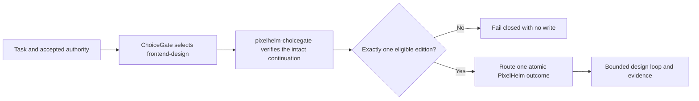

<p align="center">
  
</p>

<p align="center">
</p>

# PixelHelm

PixelHelm is the frontend-design capability family for AI-assisted UI work. It keeps
honesty, accessibility, product register, and incumbent quality as a measurable floor,
then routes each independently testable outcome to one atomic skill.

**Status:** private `2.0.0` pre-public candidate. The display name is **PixelHelm**.
The canonical GitLab project URL is intentionally unset and still requires an owner
decision. No remote, hosted-CI, provider, registry, marketplace, installation, or public
state is claimed here.

## What is already proven locally

- deterministic generation of the Lite and Full plugin trees;
- 25 Full and 15 Lite atomic skills with one canonical owner per outcome;
- 19 explicit legacy aliases that never become natural-language co-owners;
- a fail-closed ChoiceGate consumer that admits only an intact, accepted continuation;
- canonical `.pixelhelm/` state writes with conflict-safe read-only legacy fallback;
- offline family, trigger, near-miss, collision, syntax, skill, and evidence-engine checks.

The qualification contract and exact evidence boundaries are documented in
[Validation](docs/public/VALIDATION.md). Local proof is not public traction or hosted
behavior proof.

## Demo


Harborline is a checked-in worked example built from labeled synthetic data. Its
render matrix exercises desktop/mobile and light/dark states, including missing and
estimated telemetry that the design must not silently turn into certainty. See the
[fixture and reproduction notes](examples/harborline/README.md).

## Choose exactly one edition

| | PixelHelm Lite | PixelHelm Full |
|---|---:|---:|
| Role | default | alternative |
| Atomic skills | 15 | 25 |
| Ground → baseline → generate → render → evaluate → judge → repair | yes | yes |
| Tokens, bounded promotion, lessons, guidance refresh, fingerprint curation | yes | yes |
| Reference, direction, evidence brief, color, typography, motion, dataviz, content, email, video specialists | no | yes |

Lite and Full are mutually exclusive. A Full-only request returns to ChoiceGate; it
does not activate Full beside Lite.

## How the boundary works



PixelHelm consumes capability-selection decisions; it does not select its own
authority. `pixelhelm-choicegate` requires an exact caller-supplied local ChoiceGate
root and checks the accepted ChoiceGate commit/tree and capability-inventory pins. Bare,
tampered, stale, bundled, wrong-surface, or simultaneously eligible inputs fail closed.

## Atomic family

Core: `pixelhelm`, `pixelhelm-choicegate`, `pixelhelm-loop`, `pixelhelm-ground`,
`pixelhelm-baseline`, `pixelhelm-generate`, `pixelhelm-render`,
`pixelhelm-evaluate`, `pixelhelm-judge`, `pixelhelm-repair`, `pixelhelm-tokens`,
`pixelhelm-promote-design`, `pixelhelm-record-lesson`,
`pixelhelm-refresh-guidance`, and `pixelhelm-curate-fingerprints`.

Full adds `pixelhelm-reference`, `pixelhelm-directions`,
`pixelhelm-evidence-brief`, `pixelhelm-color`, `pixelhelm-typography`,
`pixelhelm-motion`, `pixelhelm-dataviz`, `pixelhelm-content`, `pixelhelm-email`, and
`pixelhelm-video-placement`.

## Local build and validation

Prerequisites for the core checks are Node.js 22 and Python 3.12. No dependency
installation or network access is needed for these commands:

```powershell
node build/build.mjs --check
python -B evals/pixelhelm/run_tests.py
python -B plugins/pixelhelm-full/skills/pixelhelm-evidence-brief/storm/demo_offline.py
```

The portable test command deliberately skips only the cases that require accepted
local authority roots. The complete boundary replay is:

```powershell
python -B evals/pixelhelm/run_tests.py `
  --choicegate-root <accepted-choicegate-root> `
  --inventory-root <accepted-inventory-root>
```

`src/` plus `build/overlays/` are the source of truth. The generated
`plugins/pixelhelm-lite/` and `plugins/pixelhelm-full/` trees must never be hand-edited.
Optional browser rendering dependencies are installed only inside the exact selected
local edition after lifecycle approval; they are not needed for the checks above.

## Distribution and readiness

PixelHelm is prepared as two directory-loaded Claude Code plugins plus a Python
distribution. The `pixelhelm` PyPI package (version `0.1.0`) ships exactly the
Python-side functionality that runs standalone: the portable verified-evidence-brief
engine and its design adapter, as published in the generated Full edition. The
repository-bound Python tooling (the eval suite and the ChoiceGate admission consumer)
stays in the repository because it requires the repository tree or external accepted
roots. The applicable offline package dry run is a clean deterministic build,
plugin-manifest validation, `python -m build`, and `twine check`. Registry lookup,
authentication, publication, marketplace activation, and live installation remain
closed.

- [Private readiness status](docs/public/READINESS.md)
- [Dependencies and optional runtime tools](docs/public/DEPENDENCIES.md)
- [Configuration applicability](docs/public/CONFIGURATION.md)
- [Release candidate](docs/public/RELEASE-CANDIDATE.md)
- [Owner-only outward handoff](docs/public/OWNER-HANDOFF.md)
- [Roadmap](ROADMAP.md)

MIT licensed. Built by Rahul Krishna.
