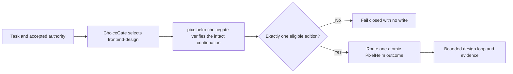

# How the activation boundary works

PixelHelm does not decide for itself when it may run. Inside an agent, capability
selection belongs to ChoiceGate, a separate capability-selection system: PixelHelm
consumes ChoiceGate's accepted decisions and verifies them before doing any work; it
never selects its own authority.



`pixelhelm-choicegate` requires an exact caller-supplied local ChoiceGate root and
checks the accepted ChoiceGate commit/tree and capability-inventory pins. Bare,
tampered, stale, bundled, wrong-surface, or simultaneously eligible inputs fail
closed with no write.

## Editions at the boundary

Lite and Full are mutually exclusive. A Full-only request returns to ChoiceGate; it
does not activate Full beside Lite.

## Replaying the boundary locally

The portable test command (`python -B evals/pixelhelm/run_tests.py`) deliberately
skips only the cases that require accepted local authority roots — that is the one
documented skip in the suite. The complete boundary replay is:

```powershell
python -B evals/pixelhelm/run_tests.py `
  --choicegate-root <accepted-choicegate-root> `
  --inventory-root <accepted-inventory-root>
```

The accepted roots are private local checkouts whose exact commit/tree pins are
recorded in [docs/public/VALIDATION.md](public/VALIDATION.md). CI runs the same
replay only when a runner supplies both roots, and otherwise never (see
`.gitlab-ci.yml`).
